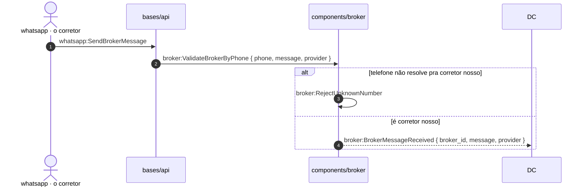

# call stack — a notação da casa

Um arquivo `callstack_mermaid.md`: uma seção `##` por FRONTEIRA do fluxo, e dentro
de cada uma um `sequenceDiagram` do mermaid. Ao lado dele, um `check.ts` que
procura no código o que o desenho declara — **o desenho não é doc, é teste.**

O porquê de cada escolha está em @03_resources/references/system/009_call_stack.md
— aqui mora só a forma.

## A forma do arquivo

```markdown
## A entrada: a mensagem do corretor vira fato



## A reação: o agente lê a mensagem e pede o share

```mermaid
…
```
```

**A lista de `##` É o índice.** Não existe mais macro view: ela era um resumo de
UMA tabela gigante, e com uma seção por fronteira o próprio sumário do arquivo
responde *quais são as fases e em que ordem*.

## Uma seção por FRONTEIRA — e a seção é a unidade de TRÊS coisas

A seção fecha onde o fluxo **troca de componente e o fato atravessa**. Ela é ao
mesmo tempo:

| a seção é | e por isso |
|---|---|
| a unidade de LEITURA | cabe numa tela; oito setas, não quarenta |
| a unidade de PROVA | `check.ts --section entrada` sai 0 com as outras vermelhas |
| a unidade de TASK | a fronteira que ela desenha É o corte da capacidade |

Corte errado dá pra medir: se a seção precisa de scroll horizontal, ela tem duas
fronteiras dentro.

## Participante com CAMINHO é nosso; ator sem caminho é de fora

```
participant SE as components/share_external      nosso — verificável
participant API as bases/api                     nosso — verificável
actor WA as whatsapp · o corretor                de fora — fora da conta
```

Isto não é enfeite: é o que o `check.ts` lê pra decidir o que procurar.
`whatsapp:SendBrokerMessage` roda no servidor do provedor e nunca viraria ✓ — na
conta, o exit 1 seria eterno e o número pararia de significar progresso.

## O TIPO DA SETA é o contrato

| seta | o que afirma |
|---|---|
| `->>` | **chamada** — alguém chama alguém, e espera |
| `-->>` | **fato emitido** — sai e ninguém espera; quem reage abre a próxima seção |
| `X->>X` | o passo interno do componente |

Trocar uma pela outra muda o desenho e muda o que o check procura (`class <Fato>`
pro fato, o nome pro método). É a distinção mais barata de escrever e a que mais
paga: ela é o que separa "o playbook manda enviar" de "o LLM decide enviar".

## A mensagem é `comp:Nome`, e o payload vem em `{ }`

```
API->>BRK: broker:validate_broker_by_phone { phone, message, provider }
BRK-->>DC: broker:BrokerMessageReceived { broker_id, message, provider }
```

**A CAIXA do nome é o que o código escreve, e ela diz o que a coisa É:**

| | caixa | por que |
|---|---|---|
| método | a da linguagem — `snake_case` em Python, `camelCase` em TS | é função; quem procurar no código procura assim |
| **fato** | **`PascalCase`, sempre** | é CLASSE, em qualquer linguagem da casa |

Não é convenção estética: é o que o `check.ts` usa pra escolher o teste. Fato ele
procura como `class <Nome>`; método, pelo nome. Escrever método em PascalCase faz
todo método sair do check em silêncio, e o achado passa a ser "não falta nada".

Skill do agente tem gramática própria, e as três formas são coisas diferentes:

```
agent:skill('playbook')                                     a skill, o SKILL.md
agent:skill_reference(playbook:how_to_route_broker_messages) o texto que o LLM LÊ pra decidir
agent:skill_script(share_external:share_links, 1..N links)   o determinístico, que emite fato
```

## `alt` são os DESFECHOS, `loop` é o fan-out

```
alt o imóvel já existe aqui
    …
else nunca vimos este anúncio
    …
end

loop EACH url · um @DBOS.step por url
    …
end
```

**Ramo que só narra sai.** Um `alt` com um braço que apenas diz "conversa normal,
a feature não existe aqui" gasta um terço da altura da seção pra afirmar que nada
acontece. O que não é o fluxo desta feature não é ramo desta feature.

O rótulo do `loop` carrega a MECÂNICA quando ela decide algo: `um @DBOS.step por
url` é o que diz que morrer na url 7 de 12 retoma na 7.

## `Note over` é o último recurso

Nota amarela ganha peso visual de bloco e não carrega prefixo de componente, então
o check não a lê — o que está numa nota **não é verificável**. Use só quando o fato
não tem seta possível (um desfecho que não chama ninguém). Se a seção precisa de
três notas pra ser entendida, o problema é o corte da seção.

## O desenho é TESTE — o `check.ts` ao lado

```
sprints/NNN_<slug>/
├── callstack_mermaid.md    o desenho
├── check.ts                 procura no código o que ele declara
├── check_output.md          o estado: ✓ / ✗ por seção
└── justfile                 `just` roda o check; `just section <s>` prova uma task
```

O check lê a GRAMÁTICA, não a semântica: participante → pasta do componente,
`->>` → método, `-->>` → `class <Fato>`, `Skill*(…)` → o nome em snake_case.

E ele **não** afere ordem, nem se o emissor do fato é o componente certo, nem se o
método mora na pasta do próprio componente. Isso é teto conhecido, e vai escrito no
`check_output.md` — check que finge cobrir tudo é pior que check nenhum.

## O que o desenho NÃO carrega

- **Decisão, pergunta aberta e teto** — `decides` / `open` / `ceiling`. Vão no
  `CONTEXT.md` da sprint, em prosa. Diagrama é péssimo lugar pra "de quem é a
  comissão", e a pergunta aberta é o que mais precisa ser lido.
- **Medição** — `arquivo:linha`, contagem, teto de config. Vão no `BASELINE.md`.
  A exceção é o `check_output.md`, que É medição e por isso é GERADO, nunca escrito.
- **O que o humano vê enquanto o trabalho roda.** A notação anterior tinha `VIEW`
  pra isso e o mermaid não tem equivalente. Perda real: hoje o estado de tela
  precisa de uma seção própria, desenhada como as outras, ou de prosa no CONTEXT.

## Exemplo vivo

- @01_projects/_parked/acme/sprints/991_share_external_v1/callstack_mermaid.md — quatro
  seções, seis componentes, e o `check.ts` que as afere contra o acme-mono
