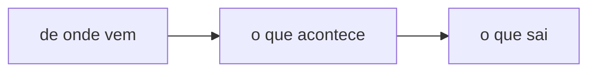

# TEMPLATE — copie para `01_projects/<projeto>/features/<feature>/CONTEXT.md`.
#
# O que a feature É, pra quem chega sem contexto. Não é história de como se
# chegou nela, não é lista de tarefas (isso é o `tasks.md` ao lado).
#
# Máximo 3 parágrafos por header. Não coube = é outro header.

# feature · <nome> — <a frase que diz do que se trata>



## Call stack

**O desenho não mora aqui.** Ele mora na pasta da sprint que o implementa —
`../../sprints/NNN_<slug>/callstack_mermaid.md`, com o `check.ts` e o `justfile`
que o aferem contra o código. Mudou de lugar porque o desenho tem o ciclo de vida
da SPRINT: na pasta da feature ele era o desenho de nenhuma sprint, e ninguém
rodava nada contra ele. A forma está em @03_resources/templates/call_stack.md.

O que fica AQUI é o link pra sprint que desenhou, e a frase que diz **por onde o
código passa** — o que responde "onde eu mexo pra mudar X" sem abrir cinco
arquivos. Vale o teto que a notação se impõe: **linha que precisa de comentário
precisa de nome melhor.**

```
../../sprints/NNN_<slug>/callstack_mermaid.md   o desenho · `just` afere
```

## O que é

Dois ou três parágrafos. O que a feature resolve, e para quem. Se ela tem um
estado ("de pé mas inerte", "entregue em draft"), ele vem aqui, com a medida.

## <a decisão que sustenta o resto>

Toda feature tem uma escolha contra-intuitiva que, se alguém desfizer sem saber,
quebra tudo. Este header é ela — com o nome do que aconteceu quando não era
assim.

## O que não dá, e as travas

O que foi tentado e não funciona, e a trava que existe pra impedir de tentar de
novo. É o header que economiza mais tempo de quem chega depois.

## Verify

```bash
<um comando que PROVA que a feature está de pé>
```

Uma linha por prova, e o comentário diz o que cada saída significa. Prova que
não distingue "quebrado" de "não rodou" não é prova.

## References

- [`tasks.md`](tasks.md) — o trabalho desta feature
- [`../<outra_feature>/CONTEXT.md`](../<outra_feature>/CONTEXT.md) — quando uma depende da outra
- @caminho/do/arquivo — o que sustenta o que está escrito aqui
