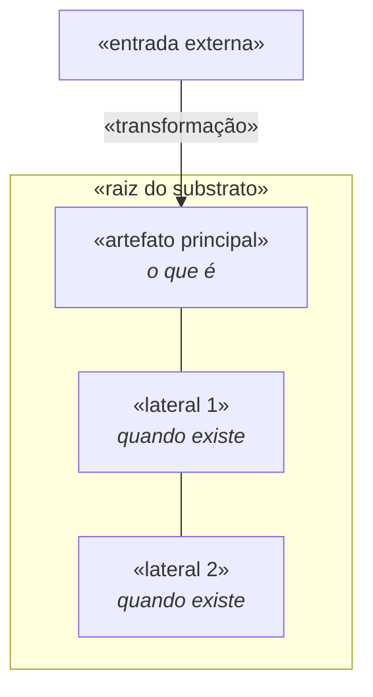
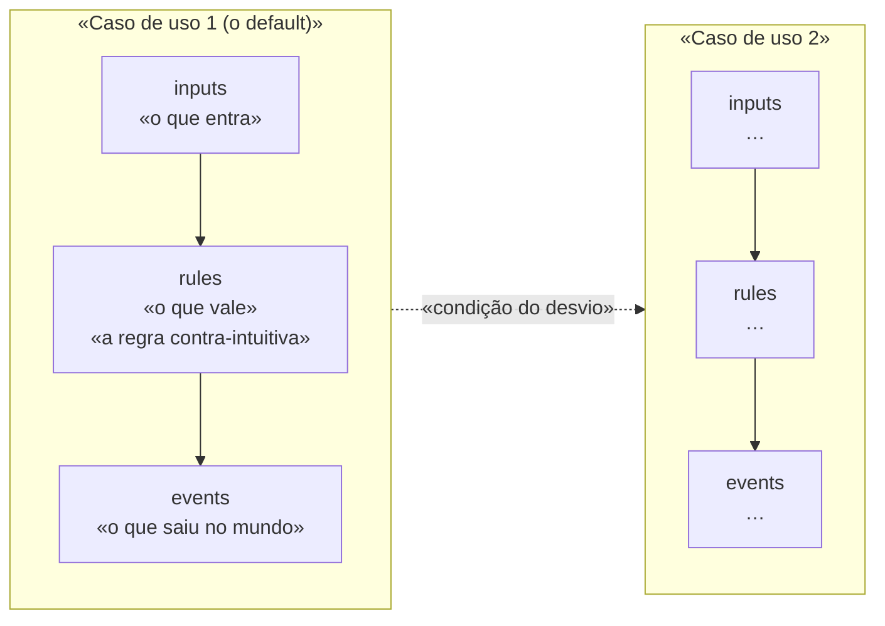
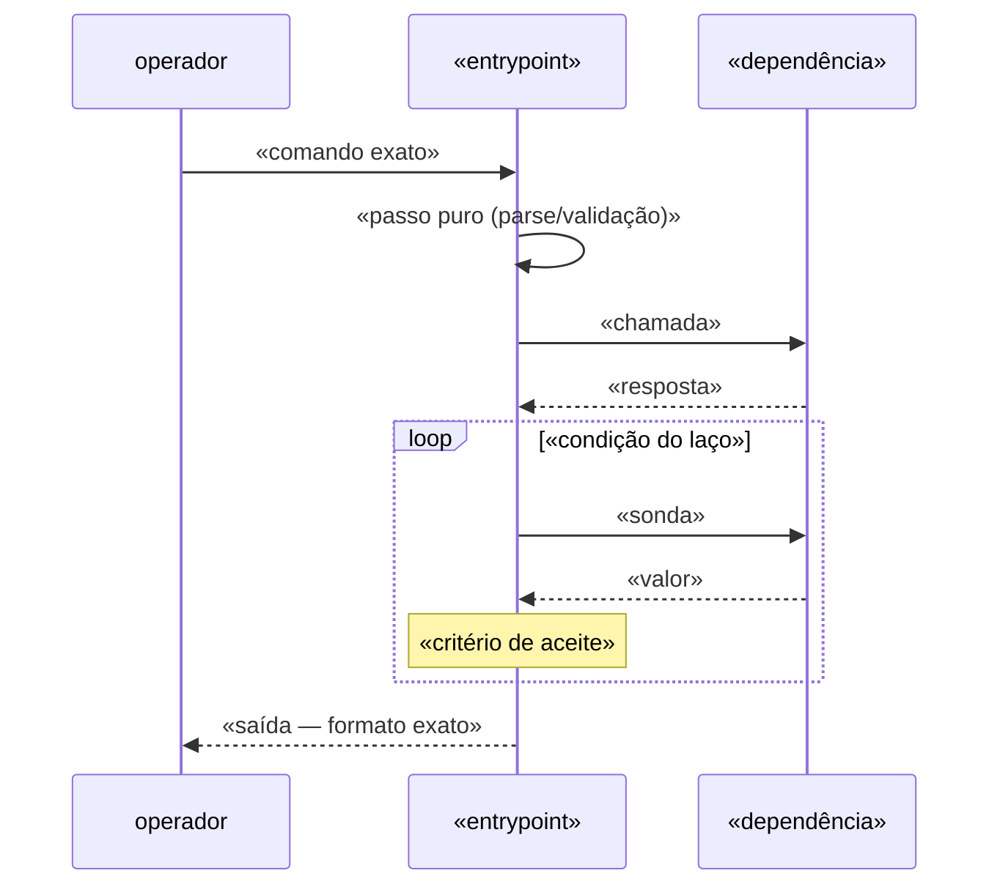
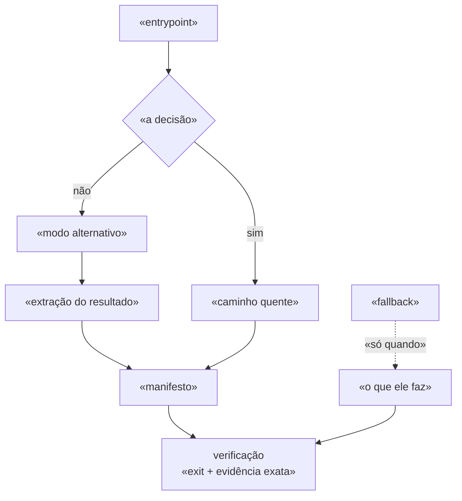

# <nome-da-skill-ou-lib>

<!-- Duas ou três frases: o que a coisa É, e o PROBLEMA que ela resolve na
     operação diária. Se a primeira versão ingênua desse problema produz um erro
     conhecido, diga qual — é o que justifica a lib existir. -->

<!-- Onde mora (caminho absoluto), versão, e a DATA em que isto foi verificado.
     Doc sem data de verificação apodrece sem avisar. -->

## 1. O substrato: o que existe no disco

<!-- 2-3 parágrafos. O dado bruto sobre o qual a lib opera: arquivo, tabela,
     fila, porta. Nomeie o formato do caminho/chave e diga qual detalhe dele
     quebra a operação quando é ignorado. -->

<!-- Segundo parágrafo: o que é OPCIONAL no substrato. Peça-que-só-existe-se é
     o que torna "copiar tudo" uma lista impossível de fixar. -->

## 2. Camada de aplicação: os casos de uso

<!-- 2-3 parágrafos. UM parágrafo listando os verbos de negócio e a TENSÃO entre
     eles (qual é o default, qual é o fallback, e por quê). Não descreva função:
     descreva o que o operador quer. -->

<!-- Segundo parágrafo: a regra que atravessa TODOS os casos de uso — a
     invariante. Normalmente é uma proibição ("nunca escreve na fonte") mais uma
     obrigação ("fecha com verificação executada"). -->

<!-- Cartão de caso de uso = entra · o que vale · sai. Teto de 6 itens por
     bloco; se passar de 6, o caso de uso são dois. -->

## 3. Call stack: <o caminho quente>

<!-- 2-3 parágrafos. Comece pela LINHA DE COMANDO exata que o operador digita.
     Depois diga qual é o trabalho DIFÍCIL do caminho — quase nunca é o efeito
     principal, é descobrir/confirmar alguma coisa depois dele. -->

<!-- Segundo parágrafo: de onde vem a informação que fecha o caminho, e a GUARDA
     que impede a leitura errada. Cite o erro real que a guarda evita, com data.
     Guarda sem história é guarda que alguém remove no próximo refactor. -->

## 4. Call stack: <o outro modo> e o fallback

<!-- 2-3 parágrafos. O modo alternativo (headless, batch, offline) e por que ele
     é o modo de VERIFICAÇÃO ou de exceção. Traga a medição: entrada, saída,
     código de saída, data. -->

<!-- Segundo parágrafo: o fallback — outro call stack e outro contrato. Diga o
     que ele garante (manifesto, hash, recusa de colisão) E o que ele não
     garante, que é o motivo de não ser o default. -->

## 5. As armadilhas medidas

<!-- Um parágrafo curto POR armadilha, cada um abrindo em negrito com o nome
     dela. Só entra aqui o que foi medido e custou tempo — nome de variável
     errado, ordenação que não ordena, valor que parece ausente e não está.
     Armadilha inventada por precaução vira ruído e some no meio das reais. -->

**<A armadilha 1>.** <o que se acredita · o que é · como se manifesta o engano>

**<A armadilha 2>.** <idem, com a data da medição>

**<A armadilha 3>.** <se houver risco de segurança/dado, é aqui, e sai com o que
FAZER, não só com o aviso>

## 6. Contrato de saída

<!-- 2-3 parágrafos. Os campos que todo relatório desta lib devolve, e qual
     deles é o que mais importa (normalmente o veredito: suportado ·
     experimental · rejeitado). O contrato existe pra próxima sessão não repetir
     caminho já conhecido como torto. -->

<!-- Segundo parágrafo: o que fazer com o experimento que FALHOU (fica como
     evidência, não se conserta em silêncio) e qual é o CHECK EXECUTÁVEL — o
     comando único que falha se a lógica quebrar, mais o controle negativo. -->

## Template

Documento novo desta forma sai de
`03_resources/templates/skills/CONTEXT.md`.
