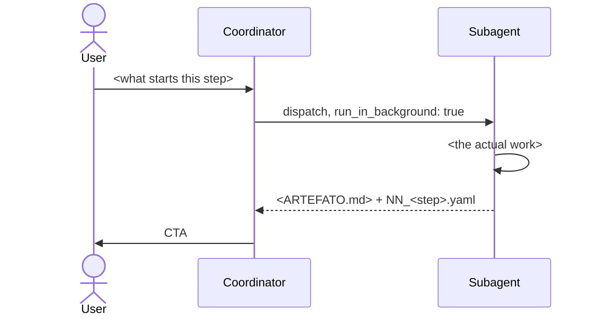

<!--
TEMPLATE — copy to `<NN_step_slug>/CONTEXT.md`, strip these comments, fill every <>.
Sections in THIS order, always. The full anatomy lives in @02_areas/00_workflows/CONTEXT.md;
this file is the skeleton, not a second copy of the rules.
-->

<!-- First block of content, always. Whoever reads only this understands who
     talks to whom, in what order. Max 7-9 nodes, branched — a long vertical
     chain doesn't read. -->

## References

Everything the subagent needs to sound and behave right, by pointer — never
re-explained inline. A copy in the prompt diverges on the first change.

- @02_areas/00_workflows/CONTEXT.md — the system: metrics, subagent discipline, run layout
- @config.yaml — task category → model/effort/substrate
- @CLAUDE.md — house rules
- @CONTEXT.md — repo map
- <@path/to/voice.md — style of voice, when the step WRITES for a human>

## Execution Runtime

`task: <category>` — resolved against @config.yaml. <Why this work is that
category. Name the category, justify it; never repeat the model name — the
number comes from config, the reason lives here.>

<Override `model:`/`effort:` in the frontmatter only when the category
genuinely doesn't fit, and say why here. Override without a written reason is
the config spreading back out.>

## Input

- <what this step consumes: the user prompt, or `<ARTEFATO>.md` from step NN-1>

## Process

<Max 7-9 tasks. If it needs a 10th, it's two steps — split it and add the new
row to the step table in @02_areas/00_workflows/CONTEXT.md. A step nobody can hold in
their head is a step nobody can tell has failed.>

1. <task>
2. <task>
3. <task>

## Output

`output/NNN_<slug>/` inside the main that opened the run, numbered down from 999
— and the COMMIT that closes the work. Those two are the whole record:
@03_resources/references/system/001_steps.md#o-run--onde-os-steps-se-acumulam.

`_events/` is NOT written. It died on 17/08 — 151 receipt folders, 3.3 MB, and a
batch of 10 tasks that owed 10 receipts left ZERO with the rule in the contract
and quoted in the prompt. A step that promises a receipt nobody writes promises
nothing.

## CTA

`my askuser ask` decides the next edge — the graph isn't always linear, and
the user picks, not the coordinator.

- "<default next step>?" (recommended) / "<alternative>" / "Stop here"
  - **<default>** → `NN+1_<step>.md`, same run
  - **<alternative>** → <where it goes>
  - **stop** → run ends here, artifacts stay as-is

<When the next step doesn't exist yet, say so honestly instead of faking an
edge.>
