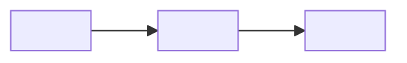

<!--
TEMPLATE — copie para `03_resources/notes/<timestamp>_<slug>.md`, apague estes comentários.
Zettelkasten: o ID é o TIMESTAMP, uma ideia por nota, o valor está nos links.
Frontmatter: copie @03_resources/templates/system/note_taking/note_frontmatter.yaml, campo a campo.
-->

---
<frontmatter — shape em @03_resources/templates/system/note_taking/note_frontmatter.yaml>
---

# <O título é a AFIRMAÇÃO, não o assunto>

<!-- "Step grande demais falha sem ninguém ver qual parte falhou" é título.
     "Sobre tamanho de step" não é — assunto não se liga a outro assunto. -->

<!-- No topo, sempre. Bate o olho e entende sem ler o resto. Poucos nós:
     se a ideia precisa de dez caixas, são várias notas. -->

<Parágrafo 1 — a ideia. Uma frase.>

<Parágrafo 2 — por que ela vale. Uma frase.>

<Parágrafo 3 — o que ela obriga. Uma frase.>

<!-- TRÊS parágrafos, no máximo, poucas palavras cada. Precisou do quarto,
     são duas notas: quebre e ligue uma na outra. Em palavras SUAS — trecho
     copiado é recorte, não nota. -->

## References

- @03_resources/references/system/001_steps.md — <por que essa liga nesta>
- @<caminho/no/repo> — <o arquivo que originou ou comprova>
- [[<YYYY-MM-DDTHHMMZ>_<slug>]] — <a nota vizinha, e o que uma diz da outra>
