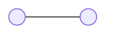

<!--
TEMPLATE — 00_system_design_big_picture.md. Título, um grafo mermaid de nós
redondos, um parágrafo de até ~30 palavras. Nada mais entra aqui — ver
`my meta resources system_design`.
-->

# system design — do que o <sistema> é feito

<Grafo de relação: uma frase, até ~30 palavras. O que cada nó representa e por
que estão ligados assim — não é fluxo de chamada, isso é `NN_system_design_<fluxo>.md`.>
