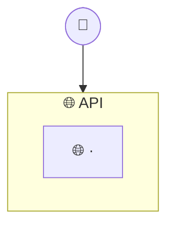

<!--
TEMPLATE — 01_system_design_layers.md. A árvore por camada, notação de
`my meta resources outline_notation`. Ver `my meta resources system_design`.
-->

# system design — por camada

<Uma frase: o que este outline cobre, e que fluxo tem doc próprio (`NN_fluxo.md`).>

## O que cada camada é

- **`🌐 API`** — <uma frase por camada>

## O que está sem filho, e por quê

- <o que ficou raso de propósito, e onde a forma completa mora>

## O que a árvore NÃO cobre (teto conhecido)

- <o que falta, sem fingir que é decisão de deixar fora>

## References

- [`00_system_design_big_picture.md`](00_system_design_big_picture.md)
