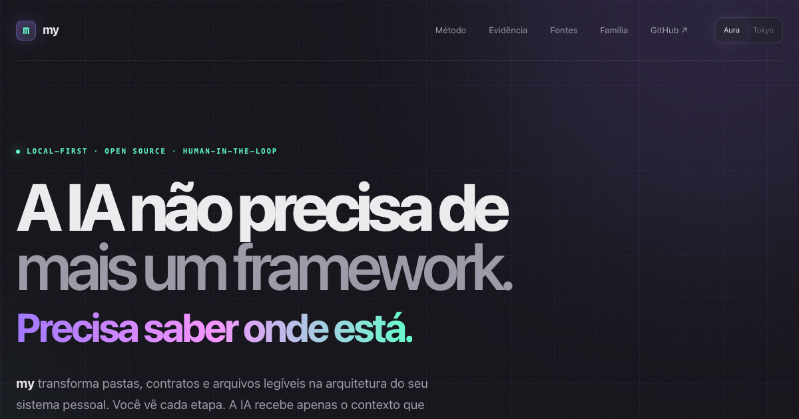

# my

**The AI doesn't need another framework. It needs to know where it is.**

[](https://github.com/biliboss/my/actions/workflows/pages.yml)



A local-first personal operating system and CLI — folders, contracts and
readable files as the architecture. You see every step. The AI receives only
the context it needs.
**[Read the thesis →](https://biliboss.github.io/my/)**

## The family

| repo | job |
|---|---|
| **my** | the system: local-first, plain text as interface, the human is the gate |
| [my-graph](https://github.com/biliboss/my-graph) | the X-ray: draws who depends on whom, read from the code |
| [my-company](https://github.com/biliboss/my-company) | the theory: the three processes every company depends on |
| [my-kanban](https://github.com/biliboss/my-kanban) | the board: one set of cards, every question |

## Public page

The repository currently ships the public thesis and evidence library while the runtime is migrated from `biliboss/me`.

- Page: https://biliboss.github.io/my/
- Study reference: [`references/icm-study.md`](references/icm-study.md)
- Source ledger: [`src/data/icm-links.json`](src/data/icm-links.json)
- Bibliography: [`src/data/icm-bibliography.json`](src/data/icm-bibliography.json)

The page uses HeroUI and includes two selectable visual systems: Aura (default) and Tokyo Night.

## Develop

```bash
bun install
python3 scripts/check_references.py
bun run dev
```

## Build

```bash
bun run check
bun run build
```

GitHub Actions publishes `dist/` to GitHub Pages on every push to `main`.

## Evidence boundary

The page cites *Interpretable Context Methodology: Folder Structure as Agent Architecture* as related research. It does not claim endorsement, controlled proof, or that every described capability has already migrated into this repository.
